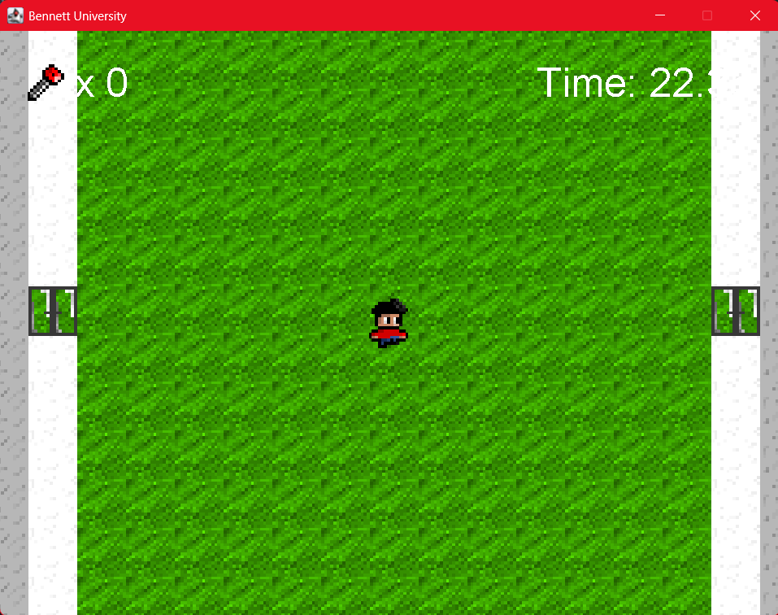
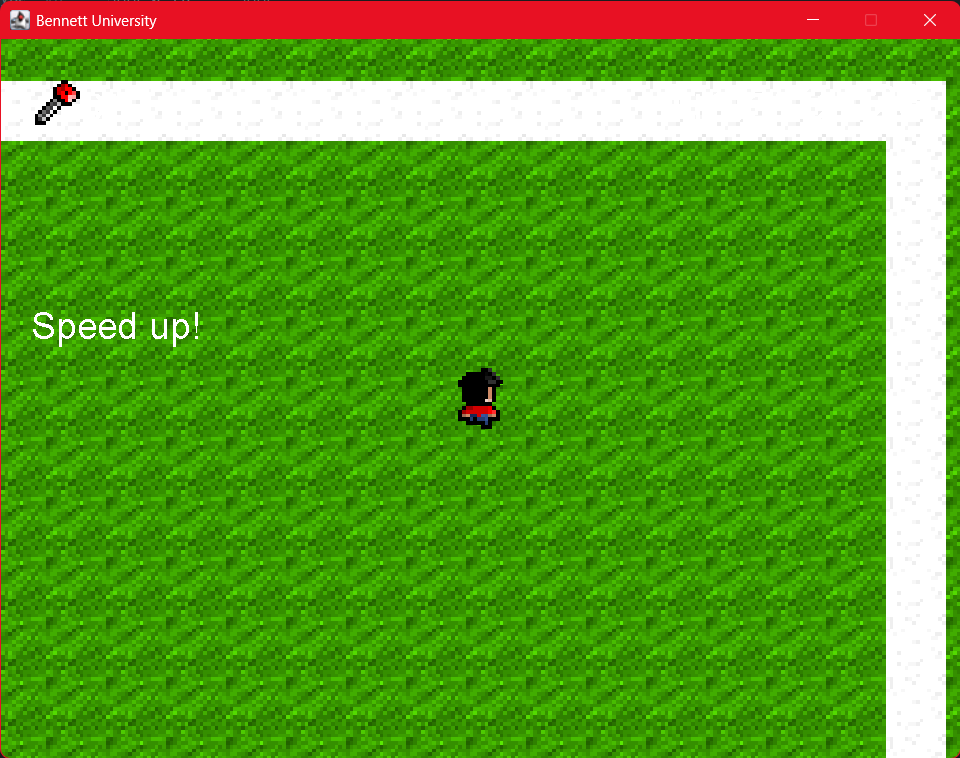
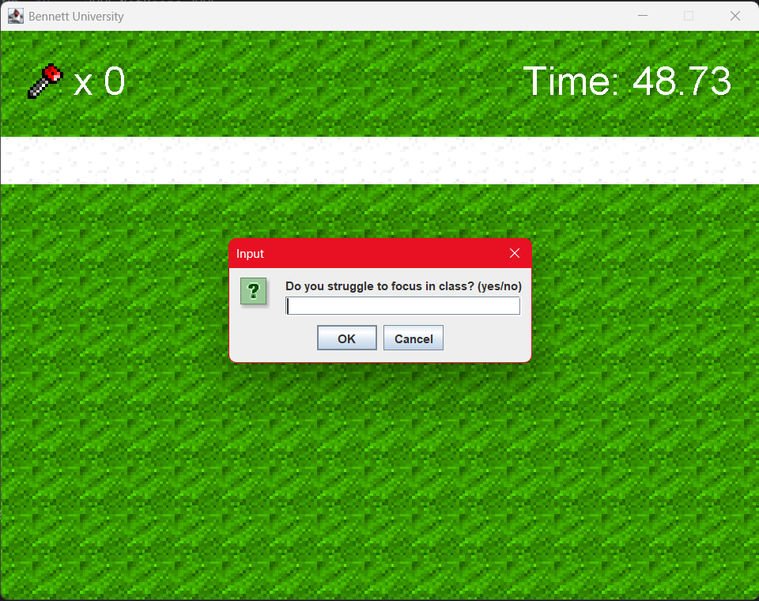
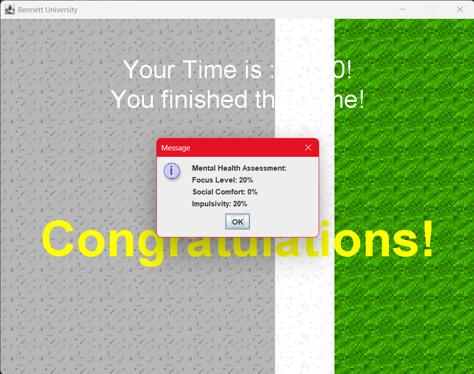

# 🧠 NeuroQuest: Mental Assessment Game

> *"Every decision tells a story your mind hasn't told you yet."*

NeuroQuest is a 2D Java-based psychological assessment game that transforms the Bennett University campus into an interactive mental exploration experience.

Players navigate through a virtual recreation of the university, interact with characters, collect keys, unlock new areas, and answer scenario-based psychological questions.

Based on player responses and in-game behavior, NeuroQuest generates an assessment of various psychological traits including:

- Social Comfort
- Focus Level
- Impulsivity

The game aims to provide an engaging and immersive self-reflection experience through gameplay.

---

## 🌟 Features

✅ Fully playable 2D Java game

✅ Virtual recreation of Bennett University campus

✅ Original hand-drawn characters and tiles

✅ NPC interactions

✅ Psychological assessment system

✅ Dynamic question-based progression

✅ Key collection and door unlocking mechanics

✅ Speed boost power-ups

✅ Mental trait analysis and scoring

✅ Immersive sound effects

---

## 🏫 Bennett University Digital Campus

NeuroQuest features a custom-built 2D recreation of the Bennett University campus.

Several university landmarks and buildings have been recreated within the game world, allowing students to explore a familiar environment while engaging in psychological self-assessment activities.

Assessment questions are integrated into different campus locations, creating an immersive and context-aware gameplay experience.

---

## 🎮 Gameplay

Players explore a 2D recreation of the Bennett University campus.

Different buildings and locations trigger unique psychological questionnaires and interactions. Players collect keys, unlock restricted areas, interact with NPCs, and discover power-ups while progressing through the game.

Responses collected throughout the journey are analyzed to generate a personalized psychological profile.

Example questions include:

- *Do you often feel restless?*
- *Do you ask questions in class?*
- *Do you enjoy social interactions?*
- *Do you frequently act without thinking?*

---

## 🧠 Assessment Parameters

| Parameter | Description |
|-----------|-------------|
| Social Comfort | Measures social interaction preferences and confidence |
| Focus Level | Evaluates attention and concentration tendencies |
| Impulsivity | Assesses spontaneous and impulsive behavior patterns |

---

## 🏗️ Game Architecture

```text
Player Input
      |
      ↓
Campus Exploration
      |
      ↓
NPC / Building Interaction
      |
      ↓
Question Trigger System
      |
      ↓
Response Collection
      |
      ↓
Trait Scoring Engine
      |
      ↓
Psychological Profile Generation
```

---

## 📂 Project Structure

```text
NeuroQuest-Mental-Assessment-Game/
│
├── src/                  # Java source code
│   ├── entity/
│   ├── main/
│   ├── tile/
│   ├── object/
│   └── ...
│
├── res/                  # Game assets
│   ├── maps/
│   ├── npc/
│   ├── objects/
│   ├── player/
│   ├── sound/
│   └── tiles/
│
├── screenshots/          # Gameplay screenshots
├── README.md
├── LICENSE
└── .gitignore
```

---

## 🛠️ Technologies Used

### Programming Language

- Java

### Development Environment

- IntelliJ IDEA

### Core Concepts

- Object-Oriented Programming (OOP)
- Event Handling
- Collision Detection
- Game Loop
- State Management

### Graphics & Design

- Custom Sprite Design
- Tile-based Map Rendering

---

## 📸 Screenshots

### Bennett University Campus



### Character Interaction



### Psychological Assessment Questions



### Final Assessment Results



---

## 🎥 Demo & Download

🌐 **Play/Download the game here:**

https://neuroquestgame.netlify.app

---

## ▶️ Running the Project

### Clone the Repository

```bash
git clone https://github.com/NejiHyuga55/NeuroQuest-Mental-Assessment-Game.git
```

### Open in IntelliJ IDEA

1. Open IntelliJ IDEA.
2. Import the project.
3. Build the project.
4. Run the main game file.

Usually:

```text
src/main/Main.java
```

---

## 🎯 Gameplay Mechanics

### 🔑 Key Collection System

Players collect keys scattered throughout the campus to unlock new areas and progress through the game.

### ⚡ Speed Boost System

Special items temporarily increase player movement speed.

### 🗣️ NPC Interactions

NPCs guide players and trigger assessment questions.

### 🏢 Building-Based Assessments

Specific campus buildings contain psychological questionnaires that influence final scores.

---

## 📊 Example Assessment Output

```text
Social Comfort : 78%
Focus Level    : 65%
Impulsivity    : 32%
```

---

## 🔮 Future Improvements

- Additional psychological dimensions
- Save and load functionality
- Multiplayer mode
- Adaptive questioning system
- Machine Learning based assessment
- Mobile version
- Detailed analytics dashboard

---

## 👥 Team

Developed by:

- Hriday Thakur

### Special Contributions

🎨 All character sprites, campus tiles, environmental assets, and visual elements were custom designed and illustrated by Hriday Thakur.

🗺️ The game world is based on a 2D recreation of the Bennett University campus.

---

## ⚠️ Disclaimer

NeuroQuest is intended for educational and self-reflection purposes only.

It is **not** a medical or diagnostic tool and should not be used as a substitute for professional psychological evaluation.

---

## 🤝 Contributing

Contributions and suggestions are welcome.

Feel free to fork the repository and submit pull requests.

---

## 📄 License

This project is licensed under the MIT License.
